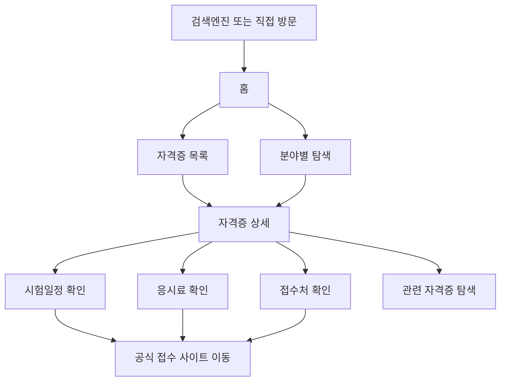
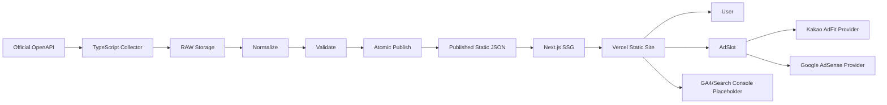
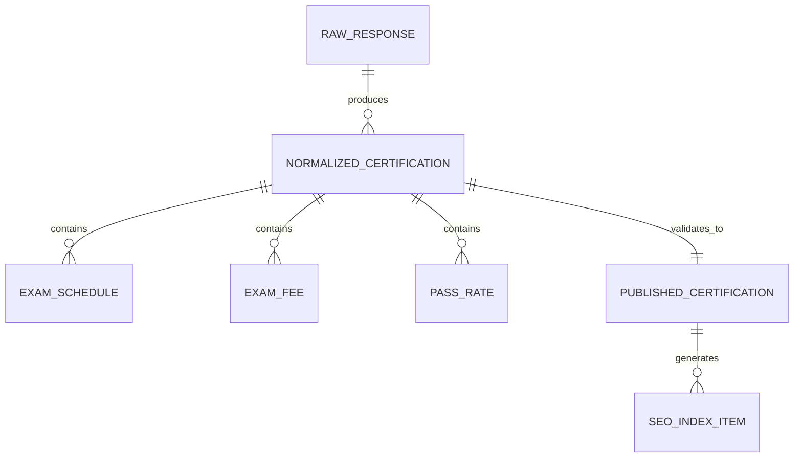

# SPEC.md

# 광고수익형 정보사이트 Core Engine + 1호 자격증 정보사이트

문서 버전: v1.0  
작성일: 2026-08-21  
상태: MVP 개발 기준 최종 명세  
대상 실행 환경: Next.js + TypeScript strict + Vercel  

---

## 0. 핵심 결정사항

이 문서는 프로젝트의 단일 기준 문서(SSOT)다. 이전 명세나 대화에 PostgreSQL, Supabase, Prisma, ORM, DB migration, Auth, 회원가입 관련 내용이 남아 있더라도 MVP에서는 모두 제거한다.

### 반드시 지킬 것

- MVP는 DB를 사용하지 않는다.
- Supabase, PostgreSQL, Prisma, ORM, DB migration을 설치하거나 구성하지 않는다.
- 회원가입, 로그인, Auth, 관리자 계정 기능을 구현하지 않는다.
- 데이터는 공식 공개 OpenAPI에서 수집한다.
- 데이터 수집은 TypeScript Collector로 구현한다.
- 공식 API 원본 RAW 데이터를 보존한다.
- RAW 데이터를 Normalize, Validate한 뒤 검증된 정적 JSON으로 publish한다.
- Next.js는 검증된 JSON을 사용해 페이지를 생성한다.
- 가능한 페이지는 SSG/static generation을 우선한다.
- 파일 publish는 partial/corrupt 상태가 노출되지 않도록 atomic 방식을 고려한다.
- 사실 데이터(시험일정, 응시료, 합격률, 날짜, 기관명 등)는 AI로 생성하지 않는다.
- API URL, 요청 파라미터, 응답 필드명은 추측하지 않고 공식 문서를 확인한다.
- 외부 API key, 광고 ID, GA4 ID, Search Console, 도메인이 없어도 fixture/mock/env placeholder로 가능한 개발을 계속한다.

---

## 1. PRD

이 섹션은 제품 요구사항 문서(PRD)다. 문제 정의, 목표, 페르소나, 사용자 스토리, 성공 지표, 기능 범위, 정보 구조를 정의한다.

## 1.1 제품 개요

### 1.1.1 프로젝트 목적

여러 광고수익형 정보사이트에서 재사용할 수 있는 Core Engine을 만든다. 첫 번째 구현체는 자격증 정보사이트다.

2호 이후 사이트의 주제는 현재 정하지 않는다. 사용자가 나중에 주제를 선정하면 Core Engine을 재사용해 별도 사이트와 별도 도메인으로 확장한다.

### 1.1.2 MVP 목표

1호 자격증 정보사이트를 기준으로, 공식 데이터 기반의 신뢰 가능한 정보 페이지를 만들고 검색 유입과 광고 수익화의 기본 구조를 검증한다.

MVP는 다음을 완료 기준으로 한다.

- 자격증 S급 7종 데이터 수집, 정규화, 검증, 정적 JSON publish
- 약 50개 수준의 유효 SEO URL 생성
- Core Engine과 Site 구현체 분리
- Kakao AdFit 우선 광고 구조 구현
- Google AdSense로 교체 가능한 AdSlot/AdProvider 구조 구현
- SEO 기본 요소 구현
- Vercel 배포 가능 상태
- 외부 ID가 없어도 placeholder로 개발, 테스트, 빌드 가능

---

## 2. PRD - 문제 정의

자격증 정보는 여러 공식/비공식 출처에 흩어져 있고, 사용자는 시험일정, 응시료, 합격률, 응시자격, 접수처 같은 정보를 빠르게 비교하기 어렵다.

광고수익형 정보사이트를 여러 개 만들려면 매번 데이터 수집, SEO, 광고 슬롯, 페이지 구조, 배포 구조를 새로 만들면 비효율적이다.

따라서 첫 사이트에서 재사용 가능한 Core Engine을 만들고, 특정 주제 사이트는 Core 위에 얇게 얹는 구조가 필요하다.

---

## 3. PRD - 목표와 비목표

### 3.1 목표

- 공식 데이터 기반 정보 제공
- 정적 JSON 기반의 빠르고 안정적인 사이트
- SEO 친화적인 URL과 메타데이터
- 광고 슬롯/광고 제공자 교체 가능 구조
- 2호 이후 사이트에 재사용 가능한 Core Engine
- DB 없이 운영 가능한 MVP
- Vercel에 쉽게 배포 가능한 구조

### 3.2 비목표

- MVP에서 DB 도입
- MVP에서 Supabase/PostgreSQL/Prisma/ORM 사용
- MVP에서 Auth/회원가입/로그인 구현
- 사용자가 직접 글을 작성하는 CMS
- 결제, 커뮤니티, 댓글, 마이페이지
- AI로 사실 데이터를 생성하는 기능
- 2호 이후 사이트 주제 확정

---

## 4. PRD - 페르소나

### P1. 자격증 준비생

- 목표: 자신에게 필요한 자격증의 시험일정, 응시료, 접수처, 기본 정보를 빠르게 확인
- 니즈: 최신성, 공식 출처, 모바일 접근성
- pain point: 정보가 흩어져 있고 광고성 글이 많음

### P2. 직장인 이직 준비자

- 목표: 직무 전환이나 승진에 도움이 되는 자격증을 비교
- 니즈: 자격증별 난이도, 일정, 비용, 관련 정보 비교
- pain point: 시험 준비 전에 어떤 자격증이 적합한지 판단하기 어려움

### P3. 사이트 운영자

- 목표: 정보사이트를 빠르게 추가하고 광고 수익화 구조를 반복 적용
- 니즈: Core 재사용, 데이터 수집 자동화, SEO 구조, 광고 교체 가능성
- pain point: 사이트마다 같은 구조를 반복 개발하는 비효율

---

## 5. PRD - 성공 지표

MVP 단계에서는 수익보다 실행 가능성과 검색 노출 준비도를 먼저 본다.

- S급 자격증 7종 데이터가 검증된 JSON으로 생성된다.
- 약 50개의 유효 SEO URL이 생성된다.
- 전체 URL이 빌드 시 오류 없이 SSG로 생성된다.
- sitemap.xml과 robots.txt가 생성된다.
- 주요 페이지에 canonical, breadcrumb, structured data가 포함된다.
- 광고 ID 없이도 레이아웃이 깨지지 않는다.
- Kakao AdFit Provider와 AdSense Provider를 설정만으로 교체할 수 있다.
- Lighthouse 기준 접근성/SEO의 치명적 문제가 없다.
- Vercel 배포 빌드가 성공한다.

---

## 6. PRD - 기능 목록

| ID | 구분 | 기능명 | MVP 포함 | 설명 |
|---|---|---|---|---|
| FEAT-1 | Core | 사이트 설정 엔진 | 예 | 사이트명, 도메인, 주제, SEO 기본값, 광고 설정을 관리 |
| FEAT-2 | Data | TypeScript Collector | 예 | 공식 OpenAPI에서 데이터를 수집 |
| FEAT-3 | Data | RAW 원본 보존 | 예 | API 응답 원본을 변경 없이 저장 |
| FEAT-4 | Data | Normalize | 예 | RAW 데이터를 내부 표준 구조로 변환 |
| FEAT-5 | Data | Validate | 예 | 필수 필드, 타입, URL, 날짜 형식을 검증 |
| FEAT-6 | Data | Atomic JSON Publish | 예 | 검증된 JSON만 공개 데이터로 교체 |
| FEAT-7 | Site | 자격증 목록 페이지 | 예 | S급 7종 목록과 핵심 정보 표시 |
| FEAT-8 | Site | 자격증 상세 페이지 | 예 | 자격증별 시험일정, 응시료, 접수처, 기본 정보 |
| FEAT-9 | Site | 비교/탐색 페이지 | 예 | 직무/분야/난이도 등 내부 탐색 URL |
| FEAT-10 | SEO | SEO 기본 구조 | 예 | metadata, canonical, sitemap, robots, breadcrumb, structured data |
| FEAT-11 | Ads | AdSlot | 예 | 위치 기반 광고 슬롯 컴포넌트 |
| FEAT-12 | Ads | AdProvider | 예 | Kakao AdFit 우선, AdSense 교체 가능 |
| FEAT-13 | Analytics | 분석 도구 연결 구조 | 예 | GA4/Search Console env placeholder |
| FEAT-14 | UX | 반응형 UI | 예 | 모바일 우선 정보 탐색 화면 |
| FEAT-15 | Ops | 배포 설정 | 예 | Vercel 빌드/환경변수/정적 생성 |
| FEAT-16 | Docs | AI 협업 가이드 | 예 | Codex CLI가 자율 구현 가능한 작업지시서 |

### 옵션 기능

- FEAT-17: RSS/feed
- FEAT-18: 관련 자격증 추천
- FEAT-19: 검색 기능
- FEAT-20: 정적 콘텐츠 수동 보강 파일

### 후순위 기능

- FEAT-21: DB 기반 운영 도구
- FEAT-22: 관리자 화면
- FEAT-23: 사용자 계정
- FEAT-24: 즐겨찾기/알림
- FEAT-25: 다중 사이트 통합 대시보드

후순위 기능은 MVP에 포함하지 않는다.

---

## 7. PRD - 사용자 스토리

### FEAT-7, FEAT-8

자격증 준비생으로서, 나는 자격증 상세 페이지에서 시험일정, 응시료, 접수처, 시행기관을 한눈에 보고 싶다. 그래야 접수 여부를 빠르게 판단할 수 있다.

### FEAT-9

직장인 이직 준비자로서, 나는 분야별 또는 목적별 자격증 목록을 보고 싶다. 그래야 내 상황에 맞는 자격증을 찾을 수 있다.

### FEAT-10

사이트 운영자로서, 나는 모든 주요 페이지가 검색엔진에 잘 노출될 수 있는 구조를 원한다. 그래야 광고수익형 사이트의 기본 유입 기반을 만들 수 있다.

### FEAT-11, FEAT-12

사이트 운영자로서, 나는 광고 제공자를 쉽게 바꾸고 싶다. 그래야 Kakao AdFit에서 Google AdSense로 전환할 때 페이지 구조를 다시 만들지 않아도 된다.

### FEAT-2 ~ FEAT-6

사이트 운영자로서, 나는 공식 데이터를 자동으로 수집하고 검증한 뒤 정적 파일로 publish하고 싶다. 그래야 잘못된 데이터나 깨진 JSON이 사용자에게 노출되지 않는다.

---

## 8. PRD - 정보 구조와 URL 전략

### 8.1 1호 사이트 주제

1호 사이트는 자격증 정보사이트다.

초기 대상은 S급 자격증 7종이다. 실제 7종은 공식 데이터 수집 가능성, 검색 수요, 정보 완결성을 기준으로 선정한다.

선정 시 주의:

- 임의로 공식 데이터가 없는 자격증을 넣지 않는다.
- 숫자를 맞추기 위해 얇은 페이지를 만들지 않는다.
- 약 50개 URL은 목표치이며 품질이 우선이다.

### 8.2 URL 예시

아래는 예시이며 실제 slug는 정규화 규칙에 따라 생성한다.

- `/`
- `/certifications`
- `/certifications/[certSlug]`
- `/certifications/[certSlug]/schedule`
- `/certifications/[certSlug]/fee`
- `/certifications/[certSlug]/eligibility`
- `/certifications/[certSlug]/apply`
- `/categories/[categorySlug]`
- `/levels/[levelSlug]`
- `/compare`

### 8.3 유효 SEO URL 기준

유효 SEO URL은 다음 기준을 만족해야 한다.

- 고유 검색 의도가 있다.
- 본문 정보가 중복만으로 구성되지 않는다.
- 공식 데이터 또는 명확한 운영자 작성 정적 정보가 있다.
- canonical이 명확하다.
- sitemap에 포함할 가치가 있다.

---

## 9. PRD - User Flow



---

## 10. TRD

이 섹션은 기술 요구사항 문서(TRD)다. 기술 스택, 시스템 아키텍처, 파일 기반 데이터 설계, 스키마, 광고/SEO/분석 구현 방식, 배포와 테스트 전략을 정의한다.

## 10.1 기술 스택

### 10.1.1 필수 스택

- Next.js
- TypeScript strict
- React
- Vercel
- 정적 JSON 파일
- Node.js 기반 TypeScript Collector

### 10.1.2 사용 금지

MVP에서 아래 항목은 사용하지 않는다.

- PostgreSQL
- Supabase
- Prisma
- ORM
- DB migration
- Auth
- 회원가입
- 로그인
- 사용자 세션

### 10.1.3 패키지 선택 원칙

- 이미 프로젝트에 있는 도구를 우선 사용한다.
- JSON schema 검증이 필요하면 Zod 등 TypeScript 친화 도구를 사용할 수 있다.
- 날짜 파싱은 표준 Date만으로 불충분하면 date-fns 같은 경량 도구를 고려한다.
- 불필요한 대형 CMS/관리자 프레임워크는 도입하지 않는다.

---

## 11. TRD - 시스템 아키텍처



### 11.1 Core와 Site 분리

Core Engine:

- 데이터 수집 파이프라인 구조
- 데이터 검증 규칙
- 광고 슬롯/제공자 구조
- SEO helper
- sitemap/robots 생성
- 공통 UI 컴포넌트
- 사이트 설정 타입

1호 자격증 Site:

- 자격증 데이터 타입
- 자격증별 페이지
- 자격증 URL 생성 규칙
- 자격증 화면 문구
- 1호 사이트 디자인 설정

---

## 12. TRD - 파일 기반 데이터 설계

DB 설계와 migration은 없다. MVP의 데이터 저장소는 파일이다.

### 12.1 폴더 구조 예시

```text
data/
  sources/
    certifications/
      raw/
        2026-08-21/
          qnet-certifications.raw.json
      normalized/
        certifications.normalized.json
      validation/
        certifications.validation.json
      published/
        certifications.json
        certification-slugs.json
        seo-index.json
scripts/
  collect/
    collect-certifications.ts
  normalize/
    normalize-certifications.ts
  validate/
    validate-certifications.ts
  publish/
    publish-certifications.ts
src/
  core/
    ads/
    seo/
    data/
    config/
  sites/
    certifications/
```

실제 프로젝트 구조가 이미 존재하면 기존 구조를 우선 존중하되, 위 책임 경계는 유지한다.

### 12.2 데이터 흐름

1. Official OpenAPI 호출
2. RAW JSON 저장
3. Normalize 실행
4. Validate 실행
5. 임시 publish 파일 생성
6. 검증 성공 시 atomic rename 또는 동일 수준의 안전한 교체
7. Next.js가 published JSON만 읽음

### 12.3 Atomic Publish 요구사항

publish 중 깨진 JSON, 빈 JSON, 일부만 쓰인 JSON이 사용자에게 노출되면 안 된다.

권장 방식:

1. `certifications.json.tmp`에 새 파일 작성
2. tmp 파일 JSON parse 검증
3. 필수 데이터 개수 검증
4. 기존 published 파일 백업 또는 유지
5. tmp 파일을 최종 파일명으로 atomic rename
6. 실패 시 기존 published 파일 유지

운영체제별 rename 동작 차이가 있을 수 있으므로 구현 후 실제 로컬 환경에서 검증한다.

### 12.4 RAW 보존 원칙

- RAW 파일은 공식 API 응답을 최대한 변경하지 않고 보존한다.
- RAW에는 수집 시각, source name, endpoint, query metadata를 함께 저장할 수 있다.
- RAW 파일은 사용자가 보는 페이지에서 직접 사용하지 않는다.

### 12.5 파일 기반 데이터 관계도

DB ERD는 만들지 않는다. 아래 관계도는 DB 테이블 관계가 아니라 정적 JSON 산출물 간의 데이터 참조 관계를 설명한다.



---

## 13. TRD - 데이터 스키마

### 13.1 Certification

```ts
type Certification = {
  id: string;
  slug: string;
  name: string;
  officialName: string;
  category: string;
  level?: string;
  issuer: string;
  officialUrl?: string;
  applicationUrl?: string;
  description?: string;
  schedules: ExamSchedule[];
  fees: ExamFee[];
  eligibility?: string;
  passRate?: PassRate[];
  source: DataSourceRef;
  updatedAt: string;
};
```

### 13.2 ExamSchedule

```ts
type ExamSchedule = {
  round?: string;
  examName?: string;
  applicationStart?: string;
  applicationEnd?: string;
  examStart?: string;
  examEnd?: string;
  resultDate?: string;
  source: DataSourceRef;
};
```

### 13.3 ExamFee

```ts
type ExamFee = {
  label: string;
  amount: number;
  currency: "KRW";
  source: DataSourceRef;
};
```

### 13.4 PassRate

```ts
type PassRate = {
  year: number;
  applicants?: number;
  passed?: number;
  rate?: number;
  source: DataSourceRef;
};
```

### 13.5 DataSourceRef

```ts
type DataSourceRef = {
  provider: string;
  endpoint?: string;
  officialPage?: string;
  fetchedAt?: string;
};
```

### 13.6 SeoIndexItem

```ts
type SeoIndexItem = {
  path: string;
  title: string;
  description: string;
  canonicalPath: string;
  priority: number;
  changeFrequency: "daily" | "weekly" | "monthly";
  lastModified?: string;
};
```

---

## 14. TRD - 데이터 검증 규칙

### 14.1 필수 검증

- `id`는 비어 있으면 안 된다.
- `slug`는 URL-safe 문자열이어야 한다.
- `name`은 비어 있으면 안 된다.
- `issuer`는 비어 있으면 안 된다.
- `updatedAt`은 ISO 날짜 문자열이어야 한다.
- `officialUrl`, `applicationUrl`은 URL 형식이어야 한다.
- 날짜 필드는 확인 가능한 날짜 형식이어야 한다.
- 응시료 amount는 0 이상의 숫자여야 한다.
- published JSON은 parse 가능해야 한다.

### 14.2 사실 데이터 원칙

다음 데이터는 AI가 생성하거나 추측하면 안 된다.

- 시험일정
- 접수기간
- 합격자 발표일
- 응시료
- 합격률
- 시행기관
- 공식 URL
- 응시자격

공식 데이터가 없으면 `unknown`, `null`, 빈 배열, "공식 데이터 확인 필요" 등 명확한 상태로 표현한다. 그럴 경우 화면에서도 불확실성을 숨기지 않는다.

---

## 15. TRD - 광고 정책

### 15.1 구조

광고는 Core Engine에 둔다.

- FEAT-11: AdSlot
- FEAT-12: AdProvider

AdSlot은 페이지 내 광고 위치를 표현한다. AdProvider는 실제 광고 네트워크 구현을 담당한다.

```ts
type AdSlotName =
  | "top-banner"
  | "in-content"
  | "sidebar"
  | "bottom-banner";

type AdProviderName = "kakao-adfit" | "google-adsense" | "placeholder";
```

### 15.2 Kakao AdFit 우선

MVP의 우선 Provider는 Kakao AdFit이다.

실제 광고 ID가 없으면 환경변수 placeholder를 사용한다.

예시:

```text
NEXT_PUBLIC_AD_PROVIDER=placeholder
NEXT_PUBLIC_KAKAO_ADFIT_UNIT_TOP=
NEXT_PUBLIC_GOOGLE_ADSENSE_CLIENT=
```

### 15.3 AdSense 교체 가능성

AdProvider 인터페이스를 통해 Google AdSense로 바꿀 수 있어야 한다. 페이지는 특정 광고 네트워크 코드를 직접 알면 안 된다.

### 15.4 광고 윤리와 정책

- 광고와 본문을 명확하게 구분한다.
- 광고를 메뉴, 다운로드, 원서접수 버튼, CTA처럼 보이게 만들지 않는다.
- 오클릭을 유도하지 않는다.
- 광고 영역에는 "광고" 또는 이에 준하는 표시를 둔다.
- 모바일에서 광고가 본문 탐색을 방해하지 않게 한다.
- 공식 접수 링크와 광고를 시각적으로 혼동시키지 않는다.

---

## 16. TRD - SEO 요구사항

FEAT-10은 MVP 필수다.

### 16.1 페이지별 기본 요소

- title
- description
- canonical
- Open Graph metadata
- robots 정책
- breadcrumb
- structured data
- 내부링크

### 16.2 sitemap

- published seo-index 기반으로 sitemap 생성
- thin page는 sitemap에 포함하지 않음
- lastModified는 데이터 updatedAt을 우선 사용

### 16.3 robots

- 공개 페이지는 index 가능
- 내부 데이터 파일, raw 파일, 임시 파일은 노출하지 않음

### 16.4 structured data

가능한 범위에서 다음을 사용한다.

- WebSite
- BreadcrumbList
- Article 또는 ItemList
- FAQPage는 실제 FAQ가 있는 경우에만 사용

구조화 데이터에 사실과 다른 내용을 넣지 않는다.

---

## 17. TRD - Analytics

FEAT-13은 MVP 필수다.

GA4와 Search Console 연결이 가능한 구조를 만든다.

실제 ID가 없으면 환경변수 placeholder로 처리한다.

```text
NEXT_PUBLIC_GA4_ID=
NEXT_PUBLIC_SITE_VERIFICATION_GOOGLE=
```

ID가 없어도 개발, 테스트, 빌드가 중단되면 안 된다.

---

## 18. TRD - 권한과 개인정보

### 18.1 권한 정책

MVP에는 사용자 계정이 없다. 따라서 사용자 권한 모델도 없다.

운영자는 코드와 환경변수, 정적 데이터 파일을 통해 사이트를 관리한다.

### 18.2 개인정보 최소 수집

MVP는 자체 회원 정보를 수집하지 않는다.

수집하지 않는 것:

- 이름
- 이메일
- 전화번호
- 주소
- 로그인 정보
- 결제 정보

외부 분석 도구 사용 시 해당 도구의 기본 정책을 따른다. 쿠키 배너가 필요한 경우는 배포 국가와 실제 도구 설정에 따라 별도 판단한다.

---

## 19. Design System

### 19.1 디자인 원칙

- 정보 탐색이 최우선이다.
- 광고보다 본문이 먼저 읽혀야 한다.
- 모바일에서 시험일정과 접수 정보가 빠르게 보여야 한다.
- 공식 링크와 광고는 명확히 구분한다.
- 과도한 장식보다 신뢰감 있는 정보형 레이아웃을 사용한다.

### 19.2 화면 톤

- 차분한 정보서비스
- 공공/교육 정보에 가까운 신뢰감
- 광고수익형이지만 광고성 과장 문구는 피함

### 19.3 색상

권장 토큰:

```text
--color-bg: #ffffff
--color-surface: #f7f8fa
--color-text: #1f2933
--color-muted: #6b7280
--color-border: #d9dee7
--color-primary: #1769aa
--color-primary-dark: #0f4f82
--color-accent: #2f855a
--color-warning: #b7791f
--color-danger: #c53030
```

### 19.4 타이포그래피

- 기본 본문: 16px 이상
- 모바일 본문 line-height: 1.6 권장
- 정보 테이블은 모바일에서 카드형 또는 가로 스크롤 대신 읽기 쉬운 스택 구조 우선

### 19.5 주요 컴포넌트

- Header
- Footer
- Breadcrumb
- CertificationCard
- CertificationSummary
- ScheduleTable
- FeeTable
- OfficialLinkButton
- AdSlot
- SourceNotice
- LastUpdated
- RelatedLinks

---

## 20. 접근성

- 모든 링크와 버튼은 키보드 접근이 가능해야 한다.
- 색상만으로 상태를 전달하지 않는다.
- 광고 영역은 본문과 구분되는 label을 가진다.
- heading 순서를 유지한다.
- 이미지가 있다면 alt를 제공한다.
- 표는 모바일에서 읽을 수 있어야 한다.
- 텍스트 대비는 WCAG AA 수준을 목표로 한다.

---

## 21. 배포 전략

### 21.1 Vercel

MVP 배포 대상은 Vercel이다.

빌드 전 데이터 생성이 필요한 경우 다음 중 하나를 선택한다.

- `prebuild`에서 collect/normalize/validate/publish 실행
- 로컬 또는 CI에서 데이터 publish 후 빌드
- API key가 없을 때 fixture 데이터로 빌드

### 21.2 환경변수

예상 환경변수:

```text
OFFICIAL_API_KEY=
NEXT_PUBLIC_SITE_URL=
NEXT_PUBLIC_AD_PROVIDER=placeholder
NEXT_PUBLIC_KAKAO_ADFIT_UNIT_TOP=
NEXT_PUBLIC_KAKAO_ADFIT_UNIT_CONTENT=
NEXT_PUBLIC_GOOGLE_ADSENSE_CLIENT=
NEXT_PUBLIC_GA4_ID=
NEXT_PUBLIC_SITE_VERIFICATION_GOOGLE=
```

환경변수가 비어 있어도 가능한 범위의 개발과 빌드는 계속되어야 한다.

### 21.3 도메인

실제 도메인이 없으면 `NEXT_PUBLIC_SITE_URL`은 placeholder 또는 Vercel preview URL 기준으로 처리한다.

---

## 22. 테스트 전략

### 22.1 필수 검증

각 Milestone마다 다음을 실행한다.

1. 구현
2. lint
3. typecheck
4. test
5. build

실패하면 원인을 분석하고 수정한 뒤 다시 검증한다. 실패 상태로 다음 단계에 넘어가지 않는다.

### 22.2 테스트 범위

- 데이터 normalize 단위 테스트
- 데이터 validate 단위 테스트
- atomic publish 실패/성공 테스트
- AdProvider 선택 테스트
- SEO helper 테스트
- sitemap 생성 테스트
- 주요 페이지 렌더링 테스트
- fixture 기반 빌드 테스트

### 22.3 외부 의존성 없는 테스트

API key가 없을 때는 fixture/mock을 사용한다.

fixture는 실제 공식 응답 구조를 확인한 뒤 만든다. 공식 응답 구조를 모르는 상태에서 임의 필드명을 확정하지 않는다.

---

## 23. Milestones

## M0. 프로젝트 기반 정리

목표: DB 없는 Next.js + TypeScript strict MVP 기반을 만든다.

작업:

- 기존 SPEC.md 또는 코드에 DB/Supabase/PostgreSQL/Prisma/ORM/Auth 흔적이 있으면 MVP 범위에서 제거
- Next.js 프로젝트 구조 확인 또는 생성
- TypeScript strict 설정 확인
- lint, typecheck, test, build 스크립트 정리
- Core와 Site 책임 경계 생성
- env placeholder 문서화
- fixture 기반 개발 경로 준비

완료 기준:

- DB 관련 패키지/설정/migration 없음
- Auth 관련 기능 없음
- `npm run lint`, `npm run typecheck`, `npm test`, `npm run build` 또는 프로젝트에 맞는 동등 명령이 성공

## M1. 데이터 파이프라인

목표: 공식 OpenAPI에서 정적 JSON publish까지 이어지는 구조를 만든다.

작업:

- 공식 API 문서 확인
- API URL과 필드명은 공식 문서 기반으로만 사용
- TypeScript Collector 구현
- RAW 저장 구현
- Normalize 구현
- Validate 구현
- Atomic publish 구현
- API key가 없을 때 fixture/mock 경로 구현

완료 기준:

- RAW 원본이 보존된다.
- normalized JSON이 생성된다.
- validation report가 생성된다.
- published JSON은 검증 통과 후에만 교체된다.
- partial/corrupt JSON이 노출되지 않는다.

## M2. 자격증 사이트 페이지

목표: 1호 자격증 사이트의 핵심 페이지를 만든다.

작업:

- S급 자격증 7종 선정 구조 구현
- 목록 페이지 구현
- 상세 페이지 구현
- 일정/응시료/접수처 섹션 구현
- 분야/수준/비교 탐색 URL 구현
- 약 50개 유효 SEO URL 생성
- thin page 방지

완료 기준:

- published JSON만으로 SSG 페이지가 생성된다.
- 주요 페이지가 모바일에서 읽기 쉽다.
- 공식 데이터가 없는 값은 추측 없이 표시된다.

## M3. 광고와 분석

목표: 수익화와 분석 연결 구조를 만든다.

작업:

- AdSlot 구현
- AdProvider 인터페이스 구현
- Kakao AdFit Provider 구현
- Google AdSense Provider placeholder 구현
- Placeholder Provider 구현
- 광고 label과 본문 구분 UI 구현
- GA4 placeholder 구현
- Search Console verification placeholder 구현

완료 기준:

- 광고 ID가 없어도 빌드가 성공한다.
- Provider 변경이 설정 중심으로 가능하다.
- 광고가 CTA나 공식 링크처럼 보이지 않는다.

## M4. SEO와 배포 준비

목표: 검색 노출과 Vercel 배포 준비를 완료한다.

작업:

- metadata 구현
- canonical 구현
- sitemap 구현
- robots 구현
- breadcrumb 구현
- structured data 구현
- 내부링크 구현
- Vercel 배포 설정 확인
- 빌드 결과 검증

완료 기준:

- sitemap과 robots가 정상 생성된다.
- 주요 페이지에 SEO 요소가 포함된다.
- Vercel 배포 빌드가 가능하다.

## M5. 운영 안정화와 확장 준비

목표: 2호 이후 사이트에 Core를 재사용할 수 있게 정리한다.

작업:

- Core/Site 경계 문서화
- 2호 사이트 추가 절차 문서화
- fixture 갱신 방법 문서화
- 데이터 수집 실패 시 운영 절차 문서화
- 광고 Provider 교체 절차 문서화
- 리스크와 후속 과제 정리

완료 기준:

- 새 주제가 정해졌을 때 Core를 재사용할 수 있는 가이드가 있다.
- 운영자가 API key, 광고 ID, 도메인을 나중에 채워도 구조 변경이 필요 없다.

---

## 24. Definition of Done

MVP는 아래 조건을 만족해야 완료로 본다.

- DB/Supabase/PostgreSQL/Prisma/ORM/Auth가 없다.
- Next.js + TypeScript strict 기반이다.
- 공식 OpenAPI 기반 Collector가 있다.
- RAW 원본 보존 구조가 있다.
- Normalize/Validate/Publish 흐름이 있다.
- Atomic publish 또는 동등한 안전장치가 있다.
- published JSON만 Next.js 페이지에서 사용한다.
- 자격증 S급 7종을 기준으로 주요 페이지가 생성된다.
- 약 50개 유효 SEO URL이 생성된다.
- metadata, canonical, sitemap, robots, breadcrumb, structured data가 있다.
- AdSlot/AdProvider 구조가 있다.
- Kakao AdFit 우선 구조가 있다.
- Google AdSense 교체 가능성이 있다.
- 광고와 본문이 명확히 구분된다.
- GA4/Search Console placeholder가 있다.
- 외부 ID가 없어도 fixture/mock/env placeholder로 개발과 빌드가 가능하다.
- lint/typecheck/test/build가 통과한다.
- Vercel 배포가 가능하다.

---

## 25. Top5 리스크와 대응

| 순위 | 리스크 | 영향 | 대응 |
|---|---|---|---|
| 1 | 공식 API 문서/응답 구조 확인 실패 | 데이터 수집 지연 | API key 없이도 fixture 기반 개발을 진행하고, 필드 확정 전에는 추측 구현 금지 |
| 2 | 데이터 publish 중 깨진 JSON 노출 | 사이트 빌드/운영 장애 | tmp 작성 후 검증, atomic rename, 실패 시 기존 파일 유지 |
| 3 | 얇은 SEO 페이지 대량 생성 | 검색 품질 저하 | 유효 검색 의도와 고유 본문 기준을 통과한 URL만 sitemap 포함 |
| 4 | 광고가 본문/CTA처럼 보임 | 정책 위반, 사용자 신뢰 저하 | 광고 label, 시각적 구분, 공식 링크와 분리 |
| 5 | Core와 1호 사이트가 강하게 결합 | 2호 사이트 재사용 어려움 | site config, provider, data type, route helper를 분리 |

---

## 26. 용어집

| 용어 | 의미 |
|---|---|
| Core Engine | 여러 정보사이트에서 재사용할 공통 기능 묶음 |
| 1호 사이트 | 첫 번째 구현체인 자격증 정보사이트 |
| 2호 사이트 | 나중에 사용자가 주제를 정해 추가할 별도 도메인 사이트 |
| RAW | 공식 API 응답 원본 |
| Normalize | RAW 데이터를 내부 표준 형태로 변환하는 과정 |
| Validate | 데이터 타입, 필수값, URL, 날짜 등을 검증하는 과정 |
| Published JSON | Next.js가 실제 페이지 생성에 사용하는 검증 완료 JSON |
| Atomic Publish | 중간에 깨진 파일이 노출되지 않도록 안전하게 최종 파일을 교체하는 방식 |
| SSG | Static Site Generation, 빌드 시점에 정적 페이지 생성 |
| AdSlot | 페이지 내 광고 위치 |
| AdProvider | 광고 네트워크 구현체 |
| Thin Page | 검색 의도나 고유 정보가 약한 얇은 페이지 |

---

## 27. Coding Convention

### 27.1 TypeScript

- `strict`를 유지한다.
- `any`는 피한다.
- 외부 데이터는 반드시 runtime validation을 거친다.
- 공식 API 응답 타입과 내부 normalized 타입을 분리한다.

### 27.2 파일/폴더

- Core 기능은 `src/core` 또는 이에 준하는 공통 영역에 둔다.
- 1호 사이트 전용 기능은 `src/sites/certifications` 또는 이에 준하는 영역에 둔다.
- 데이터 수집/변환 스크립트는 `scripts` 또는 프로젝트의 기존 스크립트 영역에 둔다.
- published JSON과 raw JSON은 분리한다.

### 27.3 네이밍

- 기능 문서와 코드 주석에서 FEAT ID를 유지한다.
- slug는 소문자 kebab-case를 우선한다.
- Provider 이름은 명확한 문자열 상수로 관리한다.

### 27.4 에러 처리

- 데이터 수집 실패와 데이터 검증 실패를 구분한다.
- publish 실패 시 기존 published 파일을 보존한다.
- 외부 ID가 없다는 이유로 전체 개발을 중단하지 않는다.

---

## 28. AI Collaboration Guide

Codex 또는 다른 AI 개발자는 다음 원칙을 따른다.

1. 먼저 이 SPEC.md를 처음부터 끝까지 읽는다.
2. 이 문서가 이전 대화나 오래된 명세보다 우선한다.
3. DB/Supabase/PostgreSQL/Prisma/ORM/Auth를 MVP에 추가하지 않는다.
4. 공식 API URL과 필드명을 추측하지 않는다.
5. API key가 없으면 fixture/mock으로 계속 개발한다.
6. 광고 ID가 없으면 placeholder Provider로 계속 개발한다.
7. 도메인이 없으면 env placeholder로 계속 개발한다.
8. 각 Milestone마다 구현 후 lint/typecheck/test/build를 실행한다.
9. 실패하면 원인을 직접 수정하고 다시 검증한다.
10. 테스트 실패 상태로 다음 Milestone에 넘어가지 않는다.
11. 사용자가 명시하지 않은 2호 사이트 주제를 임의로 정하지 않는다.
12. 사실 데이터는 AI로 생성하지 않는다.

---

## 29. Codex CLI /goal 최종 작업지시서

아래 내용을 Codex CLI에 그대로 전달해 M0~M4를 장시간 자율 구현시킬 수 있다.

```text
/goal 이 프로젝트를 실제 실행 가능한 MVP 수준까지 구현해.

먼저 프로젝트 루트의 SPEC.md를 처음부터 끝까지 읽어.
SPEC.md를 단일 기준 문서(SSOT)로 사용해.
이전 대화나 오래된 명세에 PostgreSQL, Supabase, Prisma, ORM, DB migration, Auth, 회원가입 관련 내용이 남아 있더라도 MVP에서는 모두 제거해.

[최신 확정사항]

1. 프로젝트 목적
- 여러 광고수익형 정보사이트에서 재사용할 Core Engine을 만든다.
- 첫 번째 구현체는 자격증 정보사이트다.
- 2호 이후 사이트의 주제는 현재 정하지 않는다.
- 향후 사용자가 주제를 정하면 Core Engine을 재사용해 별도 사이트/도메인으로 추가한다.

2. 기술 스택
- Next.js
- TypeScript strict
- Vercel 배포
- 현재 MVP에서는 DB를 사용하지 않는다.
- Supabase/PostgreSQL/Prisma/ORM을 설치하거나 구성하지 않는다.
- DB migration을 만들지 않는다.
- 회원가입/Auth를 구현하지 않는다.

3. 데이터 구조
- 공식 공개 API/OpenAPI에서 자격증 데이터를 수집한다.
- TypeScript Collector가 데이터를 수집한다.
- 원본 RAW 데이터를 보존한다.
- normalize/validate 후 정적 JSON 데이터로 생성한다.
- 검증된 JSON만 publish한다.
- publish는 partial/corrupt 상태가 노출되지 않도록 atomic 방식 또는 동등한 안전장치를 둔다.
- Next.js가 검증된 published JSON을 사용해 페이지를 생성한다.
- 가능한 페이지는 SSG/static generation을 우선한다.
- 날짜, 합격률, 시험일정, 응시료 등 사실 데이터를 AI로 생성하지 않는다.
- API URL이나 필드명을 추측하지 말고 공식 문서를 확인한다.
- 공식 API key가 없으면 fixture/mock/env placeholder로 가능한 개발을 계속한다.

4. 첫 사이트
- 자격증 정보사이트
- 초기 S급 자격증 7종
- 약 50개의 유효 SEO URL을 목표로 한다.
- 숫자를 맞추기 위해 가치 없는 중복/얇은 페이지를 만들지 않는다.

5. 광고
- 광고 시스템은 Core에 둔다.
- AdSlot -> AdProvider 구조로 만든다.
- Kakao AdFit을 우선 Provider로 한다.
- Google AdSense Provider로 교체 가능하게 만든다.
- 실제 광고 ID가 없으면 환경변수/placeholder 구조까지만 완성하고 나머지 개발을 계속한다.
- 광고와 본문을 명확하게 구분한다.
- 광고를 메뉴, 다운로드, 원서접수 버튼, CTA처럼 위장하지 않는다.
- 오클릭을 유도하지 않는다.
- 광고 ID가 없다는 이유로 작업을 멈추지 않는다.

6. SEO
- metadata
- canonical
- sitemap
- robots
- breadcrumb
- structured data
- 내부링크
를 구현한다.

7. Analytics
- GA4와 Search Console 연결 가능한 구조를 만든다.
- 실제 ID가 없으면 환경변수 placeholder로 처리한다.

[진행 방법]

SPEC.md의 M0 -> M1 -> M2 -> M3 -> M4 순서로 진행해.
DB 관련 작업은 전부 제거하고 정적 JSON 기반 구조로 대체해.

각 Milestone마다:
1. 구현
2. lint
3. typecheck
4. test
5. build
를 실행해.

실패하면 원인을 분석하고 직접 수정한 뒤 다시 검증해.
테스트가 실패한 상태로 다음 단계로 넘어가지 마.

필요한 npm/pnpm 패키지는 직접 설치해.
필요한 파일과 폴더는 직접 생성/수정해.
외부 API key, 광고 ID, GA4 ID, Search Console verification, 실제 도메인이 없어도 fixture/mock/env placeholder로 가능한 개발은 계속해.

구현 범위는 M0~M4까지다.
M5는 문서화와 확장 준비로 남겨두되, M0~M4 구현 중 자연스럽게 필요한 최소 문서는 작성해.

마지막에 다음을 보고해:
- 변경 파일 요약
- M0~M4 완료 여부
- 실행한 검증 명령과 결과
- 남은 외부 입력값(API key, 광고 ID, 도메인 등)
- 알려진 리스크
```

---

## 30. MVP 요약

MVP는 DB 없는 정적 정보사이트다. 공식 OpenAPI에서 자격증 데이터를 수집하고, RAW 원본을 보존한 뒤 Normalize/Validate를 거쳐 검증된 JSON만 publish한다. Next.js는 이 JSON으로 자격증 정보 페이지를 SSG 우선 생성한다.

Core Engine은 광고, SEO, 데이터 파이프라인, 사이트 설정을 담당한다. 1호 사이트는 자격증 정보에 집중한다. 광고는 Kakao AdFit 우선이며 AdSense로 교체 가능한 구조를 가진다.

---

## 31. 후속 질문 5개

1. Q1. 초기 S급 자격증 7종은 사용자가 직접 지정할까요, 아니면 공식 데이터 수집 가능성과 검색 수요 기준으로 Codex가 후보를 제안할까요?
2. Q2. 공식 OpenAPI 후보는 어떤 기관을 우선 확인할까요? 예: Q-Net, HRD-Net, 공공데이터포털
3. Q3. 1호 사이트의 브랜드명과 도메인 후보가 있나요?
4. Q4. 광고는 MVP에서 Kakao AdFit placeholder까지만 둘까요, 아니면 AdSense placeholder도 동시에 화면 테스트까지 할까요?
5. Q5. 약 50개 SEO URL 중 비교/탐색 페이지는 분야별 중심으로 만들까요, 시험일정/응시료 같은 의도별 중심으로 만들까요?
